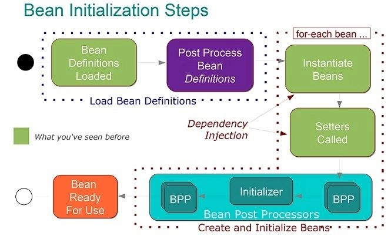

# Spring Java Interview Questions

+ [Spring Boot questions](#spring-boot-questions)
    + [What Is Spring Boot and What Are Its Main Features?](#what-is-spring-boot-and-what-are-its-main-features)
    + [What Are the Differences Between Spring and Spring Boot?](#what-are-the-differences-between-spring-and-spring-boot)
    + [How to Disable a Specific Auto-Configuration?](#how-to-disable-a-specific-auto-configuration)
    + [How to Use Spring Boot for Command-Line Applications?](#how-to-use-spring-boot-for-command-line-applications)
    + [What Does It Mean That Spring Boot Supports Relaxed Binding?](#what-does-it-mean-that-spring-boot-supports-relaxed-binding)
    + [How to Write Integration Tests?](#how-to-write-integration-tests)
    + [What Is Spring Boot Actuator Used For?](#what-is-spring-boot-actuator-used-for)
    + [What Basic Annotations Does Spring Boot Offer?](#what-basic-annotations-does-spring-boot-offer)
    + [Which Embedded Servers Does Spring Boot Support, and How to Change the Default?](#which-embedded-servers-does-spring-boot-support-and-how-to-change-the-default)
+ [Spring Core](#spring-core)
    + [What Spring Sub-Projects Do You Know? Describe Them Briefly](#what-spring-sub-projects-do-you-know-describe-them-briefly)
    + [What Is Dependency Injection?](#what-is-dependency-injection)
    + [How Can We Inject Beans in Spring?](#how-can-we-inject-beans-in-spring)
    + [Which Is the Best Way of Injecting Beans and Why?](#which-is-the-best-way-of-injecting-beans-and-why)
    + [What Is a Spring Bean?](#what-is-a-spring-bean)
    + [What Is the Default Bean Scope in Spring Framework?](#what-is-the-default-bean-scope-in-spring-framework)
    + [How to Define the Scope of a Bean?](#how-to-define-the-scope-of-a-bean)
    + [Are Singleton Beans Thread-Safe?](#are-singleton-beans-thread-safe)
    + [What Does the Spring Bean Life Cycle Look Like?](#what-does-the-spring-bean-life-cycle-look-like)
    + [What Is Spring Security?](#what-is-spring-security)
    + [Name Some of the Design Patterns Used in the Spring Framework?](#name-some-of-the-design-patterns-used-in-the-spring-framework)
    + [What Is the Role of the @Autowired Annotation?](#what-is-the-role-of-the-autowired-annotation)
    + [Explain the Difference Between @Controller and @RestController?](#explain-the-difference-between-controller-and-restcontroller)
    + [Describe a PathVariable](#describe-a-pathvariable)
    + [Validation Using Spring MVC](#validation-using-spring-mvc)
    + [What Are the @RequestBody and the @ResponseBody Annotations?](#what-are-the-requestbody-and-the-responsebody-annotations)
    + [What Is the BindingResult?](#what-is-the-bindingresult)
+ [Spring Web MVC](#spring-web-mvc)
    + [What Is a Controller in Spring MVC?](#what-is-a-controller-in-spring-mvc)
    + [How Does the @RequestMapping Annotation Work?](#how-does-the-requestmapping-annotation-work)
+ [Spring Data Access](#spring-data-access)
    + [What Is Spring JdbcTemplate Class and How to Use It?](#what-is-spring-jdbctemplate-class-and-how-to-use-it)
    + [How to Enable Transactions in Spring and What Are Their Benefits?](#how-to-enable-transactions-in-spring-and-what-are-their-benefits)
    + [What Is Spring DAO?](#what-is-spring-dao)
+ [Spring Reactive](#spring-reactive)    
    + [What Is Reactive Programming?](#what-is-reactive-programming)
    + [What Is Spring WebFlux?](#what-is-spring-webflux)
    + [What Are the Disadvantages of Using Reactive Streams?](#what-are-the-disadvantages-of-using-reactive-streams)
        
## Spring Boot questions

### What Is Spring Boot and What Are Its Main Features?

Spring Boot is essentially a framework for rapid application development built on top of the Spring Framework. 
With its auto-configuration and embedded application server support, combined with the extensive documentation 
and community support it enjoys, Spring Boot is one of the most popular technologies in the Java ecosystem as of date.

Here are a few salient features:

+ Starters – a set of dependency descriptors to include relevant dependencies at a go
+ Auto-configuration – a way to automatically configure an application based on the dependencies present on the classpath
+ Actuator – to get production-ready features such as monitoring
+ Security
+ Logging

### What Are the Differences Between Spring and Spring Boot?

The Spring Framework provides multiple features that make the development of web applications easier. 
These features include dependency injection, data binding, aspect-oriented programming, data access and many more.


Over the years, Spring has been growing more and more complex, and the amount of configuration such application requires 
can be intimidating. This is where Spring Boot comes in handy — it makes configuring a Spring application a breeze.

Essentially, while Spring is unopinionated, Spring Boot takes an opinionated view of the platform and libraries, 
letting us get started quickly.

Here are two of the most important benefits Spring Boot brings in:

+ Auto-configure applications based on the artifacts it finds on the classpath
+ Provide non-functional features common to applications in production, such as security or health checks

### How to Disable a Specific Auto-Configuration?

If we want to disable a specific auto-configuration, we can indicate it using the exclude attribute of 
the @EnableAutoConfiguration annotation.

For instance, this code snippet neutralizes DataSourceAutoConfiguration:
```java
// other annotations
@EnableAutoConfiguration(exclude = DataSourceAutoConfiguration.class)
public class MyConfiguration { }
```

We can also disable an auto-configuration with the spring.autoconfigure.exclude environment property. 
This setting in the application.properties file does the same thing as before:

```properties
spring.autoconfigure.exclude=org.springframework.boot.autoconfigure.jdbc.DataSourceAutoConfiguration
```

### How to Use Spring Boot for Command-Line Applications?

Just like any other Java program, a Spring Boot command-line application must have a main method.

This method serves as an entry point, which invokes the SpringApplication#run method to bootstrap the application:

```java
@SpringBootApplication
public class MyApplication {
    public static void main(String[] args) {
        SpringApplication.run(MyApplication.class);
        // other statements
    }
}
```

The SpringApplication class then fires up a Spring container and auto-configures beans.

Notice we must pass a configuration class to the run method to work as the primary configuration source. 
By convention, this argument is the entry class itself.

After calling the run method, we can execute other statements as in a regular program.

### What Are Possible Sources of External Configuration?

Spring Boot provides support for external configuration, allowing us to run the same application in various environments. 
We can use properties files, YAML files, environment variables, system properties and command-line option arguments to 
specify configuration properties.

We can then gain access to those properties using the @Value annotation, a bound object via 
the @ConfigurationProperties annotation, or the Environment abstraction.

### What Does It Mean That Spring Boot Supports Relaxed Binding?

Relaxed binding in Spring Boot is applicable to the type-safe binding of configuration properties.

With relaxed binding, the key of a property doesn't need to be an exact match of a property name. 
Such an environment property can be written in camelCase, kebab-case, snake_case, or in uppercase with 
words separated by underscores.

For example, if a property in a bean class with the @ConfigurationProperties annotation is named myProp, 
it can be bound to any of these environment properties: myProp, my-prop, my_prop, or MY_PROP.

### How to Write Integration Tests?

When running integration tests for a Spring application, we must have an ApplicationContext.

To make our life easier, Spring Boot provides a special annotation for testing — @SpringBootTest. 
This annotation creates an ApplicationContext from configuration classes indicated by its classes attribute.

In case the classes attribute isn't set, Spring Boot searches for the primary configuration class. 
The search starts from the package containing the test until it finds a class annotated 
with @SpringBootApplication or @SpringBootConfiguration.

### What Is Spring Boot Actuator Used For?

Essentially, Actuator brings Spring Boot applications to life by enabling production-ready features. 
These features allow us to monitor and manage applications when they're running in production.

Here are some of the most common built-in endpoints Actuator provides:

+ env exposes environment properties
+ health shows application health information
+ httptrace displays HTTP trace information
+ info displays arbitrary application information
+ metrics shows metrics information
+ loggers shows and modifies the configuration of loggers in the application
+ mappings displays a list of all @RequestMapping paths

### What Basic Annotations Does Spring Boot Offer?

The primary annotations that Spring Boot offers reside in its org.springframework.boot.autoconfigure and its sub-packages.

Here are a couple of basic ones:

+ @EnableAutoConfiguration – to make Spring Boot look for auto-configuration beans on its classpath and automatically apply them
+ @SpringBootApplication – to denote the main class of a Boot Application. This annotation combines @Configuration, 
@EnableAutoConfiguration and @ComponentScan annotations with their default attributes.

###  Which Embedded Servers Does Spring Boot Support, and How to Change the Default?

As of date, Spring MVC supports Tomcat, Jetty and Undertow. Tomcat is the default application server supported 
by Spring Boot's web starter.

Spring WebFlux supports Reactor Netty, Tomcat, Jetty and Undertow with Reactor Netty as default.

In Spring MVC, to change the default, let's say to Jetty, we need to exclude Tomcat and include Jetty in the dependencies.

## Spring Core

### What Spring Sub-Projects Do You Know? Describe Them Briefly.

+ Core – a key module that provides fundamental parts of the framework, such as IoC or DI
+ JDBC – enables a JDBC-abstraction layer that removes the need to do JDBC coding for specific vendor databases
+ ORM integration – provides integration layers for popular object-relational mapping APIs, such as JPA, JDO and Hibernate
+ Web – a web-oriented integration module that provides multipart file upload, 
Servlet listeners and web-oriented application context functionalities
+ MVC framework – a web module implementing the Model View Controller design pattern
+ AOP module – aspect-oriented programming implementation allowing the definition of clean method-interceptors and pointcuts

### What Is Dependency Injection?

Dependency injection, an aspect of Inversion of Control (IoC), is a general concept stating that we do not create our 
objects manually but instead describe how they should be created. 
Then an IoC container will instantiate required classes if needed.

### How Can We Inject Beans in Spring?

A few different options exist in order to inject Spring beans:

+ Setter injection
+ Constructor injection
+ Field injection
The configuration can be done using XML files or annotations.

### Which Is the Best Way of Injecting Beans and Why?

The recommended approach is to use constructor arguments for mandatory dependencies and setters for optional ones. 
This is because constructor injection allows injecting values to immutable fields and makes testing easier.

### What Is a Spring Bean?

The Spring Beans are Java Objects that are initialized by the Spring IoC container.

### What Is the Default Bean Scope in Spring Framework?

By default, a Spring Bean is initialized as a singleton.

### How to Define the Scope of a Bean?

In order to set Spring Bean's scope, we can use @Scope annotation or “scope” attribute in XML configuration files. Note that there are five supported scopes:

+ Singleton
+ Prototype
+ Request
+ Session
+ Global-session

### Are Singleton Beans Thread-Safe?

No, singleton beans are not thread-safe, as thread safety is about execution, 
whereas the singleton is a design pattern focusing on creation. Thread safety depends only on the bean implementation itself.

### What Does the Spring Bean Life Cycle Look Like?

First, a Spring bean needs to be instantiated based on Java or XML bean definition. 
It may also be required to perform some initialization to get it into a usable state. 
After that, when the bean is no longer required, it will be removed from the IoC container.

The whole cycle with all initialization methods is shown in the image



### What Is Spring Security?

Spring Security is a separate module of the Spring framework that focuses on providing authentication 
and authorization methods in Java applications. It also takes care of most of the common security vulnerabilities 
such as CSRF attacks.

To use Spring Security in web applications, we can get started with the simple annotation @EnableWebSecurity.

### Name Some of the Design Patterns Used in the Spring Framework?

+ Singleton Pattern – singleton-scoped beans
+ Factory Pattern – Bean Factory classes
+ Prototype Pattern – prototype-scoped beans
+ Adapter Pattern – Spring Web and Spring MVC
+ Proxy Pattern – Spring Aspect-Oriented Programming support
+ Template Method Pattern – JdbcTemplate, HibernateTemplate, etc.
+ Front Controller – Spring MVC DispatcherServlet
+ Data Access Object – Spring DAO support
+ Model View Controller – Spring MVC

### What Is the Role of the @Autowired Annotation?

The @Autowired annotation can be used with fields or methods for injecting a bean by type. 
This annotation allows Spring to resolve and inject collaborating beans into your bean.

### What Is the Role of the @Qualifier Annotation?

It is used simultaneously with the @Autowired annotation to avoid confusion when multiple instances of a bean type are present.

### What’s the Difference Between @Controller, @Component, @Repository, and @Service Annotations in Spring?

+ @Controller – indicates that the class serves the role of a controller, 
and detects @RequestMapping annotations within the class
+ @Service – indicates that the class holds business logic and calls methods in the repository layer
+ @Repository – indicates that the class defines a data repository; its job is to catch platform-specific exceptions 
and re-throw them as one of Spring’s unified unchecked exceptions

## Spring Web MVC

### What Is a Controller in Spring MVC?

Simply put, all the requests processed by the DispatcherServlet are directed to classes annotated with @Controller. 
Each controller class maps one or more requests to methods that process and execute the requests with provided inputs.

### How Does the @RequestMapping Annotation Work?

The @RequestMapping annotation is used to map web requests to Spring Controller methods. In addition to simple use cases, 
we can use it for mapping of HTTP headers, binding parts of the URI with @PathVariable, and working with URI 
parameters and the @RequestParam annotation.

### Explain the Difference Between @Controller and @RestController?

The main difference between the @Controller and @RestController annotations is that the @ResponseBody annotation 
is automatically included in the @RestController. This means that we don't need to annotate our handler methods with 
the @ResponseBody. We need to do this in a @Controller class if we want to write response type directly to 
the HTTP response body.

### Describe a PathVariable

We can use the @PathVariable annotation as a handler method parameter in order to extract the value of a URI template variable.

For example, if we want to fetch a user by id from the www.mysite.com/user/123, 
we should map our method in the controller as /user/{id}:

```java
@RequestMapping("/user/{id}")
public String handleRequest(@PathVariable("id") String userId, Model map) {}
```
The @PathVariable has only one element named value. It's optional and we use it to define the URI template variable name. 
If we omit the value element, then the URI template variable name must match the method parameter name.

It's also allowed to have multiple @PathVariable annotations, either by declaring them one after another:

```java
@RequestMapping("/user/{userId}/name/{userName}")
public String handleRequest(@PathVariable String userId,
  @PathVariable String userName, Model map) {}
```
or putting them all in a  Map<String, String> or MultiValueMap<String, String>:
```java
@RequestMapping("/user/{userId}/name/{userName}")
public String handleRequest(@PathVariable Map<String, String> varsMap, Model map) {}
```

### Validation Using Spring MVC

Spring MVC supports JSR-303 specifications by default. We need to add JSR-303 and its implementation dependencies to 
our Spring MVC application. Hibernate Validator, for example, is one of the JSR-303 implementations at our disposal.

JSR-303 is a specification of the Java API for bean validation, part of Jakarta EE and JavaSE, which ensures 
that properties of a bean meet specific criteria, using annotations such as @NotNull, @Min, and @Max.

Spring offers the @Validator annotation and the BindingResult class. The Validator implementation will raise errors in 
the controller request handler method when we have invalid data. Then we may use the BindingResult class to get those errors. 

### What Are the @RequestBody and the @ResponseBody Annotations?

The @RequestBody annotation, used as a handler method parameter, binds the HTTP Request body to a transfer or 
a domain object. Spring automatically deserializes incoming HTTP Request to the Java object using Http Message Converters.

When we use the @ResponseBody annotation on a handler method in the Spring MVC controller, 
it indicates that we'll write the return type of the method directly to the HTTP response body. 
We'll not put it in a Model, and Spring won't interpret as a view name.

### What Is the BindingResult?

BindingResult is an interface from org.springframework.validation package that represents binding results. 
We can use it to detect and report errors in the submitted form. 
It's easy to invoke — we just need to ensure that we put it as a parameter right after the form object we're validating. 
The optional Model parameter should come after the BindingResult, as it can be seen in the custom validator tutorial:

```java
@PostMapping("/user")
public String submitForm(@Valid NewUserForm newUserForm, 
  BindingResult result, Model model) {
    if (result.hasErrors()) {
        return "userHome";
    }
    model.addAttribute("message", "Valid form");
    return "userHome";
}
```

When Spring sees the @Valid annotation, it'll first try to find the validator for the object being validated. 

## Spring Data Access

### What Is Spring JdbcTemplate Class and How to Use It?

The Spring JDBC template is the primary API through which we can access database operations logic that we’re interested in:

Creation and closing of connections
Executing statements and stored procedure calls
Iterating over the ResultSet and returning results
In order to use it, we'll need to define the simple configuration of DataSource:

```java
@Configuration
@ComponentScan("org.baeldung.jdbc")
public class SpringJdbcConfig {
    @Bean
    public DataSource mysqlDataSource() {
        DriverManagerDataSource dataSource = new DriverManagerDataSource();
        dataSource.setDriverClassName("com.mysql.jdbc.Driver");
        dataSource.setUrl("jdbc:mysql://localhost:3306/springjdbc");
        dataSource.setUsername("guest_user");
        dataSource.setPassword("guest_password");
 
        return dataSource;
    }
}
```

### How to Enable Transactions in Spring and What Are Their Benefits?

There are two distinct ways to configure Transactions — with annotations 
or by using Aspect-Oriented Programming (AOP) — each with their advantages.

Here are the benefits of using Spring Transactions, according to the official docs:

+ Provide a consistent programming model across different transaction APIs such as JTA, JDBC, Hibernate, JPA and JDO
+ Support declarative transaction management
+ Provide a simpler API for programmatic transaction management than some complex transaction APIs such as JTA
+ Integrate very well with Spring's various data access abstractions

### What Is Spring DAO?

Spring Data Access Object (DAO) is Spring's support provided to work with data access technologies like JDBC, 
Hibernate and JPA in a consistent and easy way.

## Spring Reactive

### What Is Reactive Programming?

Reactive programming is about non-blocking, event-driven applications that scale with a small number of threads, 
with back pressure being a key ingredient that aims to ensure producers don't overwhelm consumers.

These are the primary benefits of reactive programming:

+ Increased utilization of computing resources on multicore and multi-CPU hardware
+ Increased performance by reducing serialization
+ Reactive programming is generally event-driven, in contrast to reactive systems, 
which are message-driven. So, using reactive programming does not mean we're building a reactive system, 
which is an architectural style.

However, reactive programming may be used as a means to implement reactive systems if we follow the Reactive Manifesto, 
which is quite vital to understand.

Based on this, reactive systems have four important characteristics:

+ Responsive – The system should respond in a timely manner.
+ Resilient – In case the system faces any failure, it should stay responsive.
+ Elastic – Reactive systems can react to changes and stay responsive under varying workload.
+ Message-driven – Reactive systems need to establish a boundary between components by relying on asynchronous message passing.

### What Is Spring WebFlux?

Spring WebFlux is Spring's reactive-stack web framework, and it's an alternative to Spring MVC.
In order to achieve this reactive model and be highly scalable, the entire stack is non-blocking.

### What Are the Mono and Flux Types?

The WebFlux framework in Spring Framework 5 uses Reactor as its async foundation.

This project provides two core types: Mono to represent a single async value and Flux to represent a stream of async values. 
They both also implement the Publisher interface defined in the Reactive Streams specification.

Mono implements Publisher and returns 0 or 1 elements:
```java
public abstract class Mono<T> implements Publisher<T> {...}
```

And Flux implements Publisher and returns N elements:
```java
public abstract class Flux<T> implements Publisher<T> {...}
```

By definition, the two types represent streams, and so they're both lazy. 
This means nothing is executed until we consume the stream using the subscribe() method. Both types are also immutable, 
so calling any method will return a new instance of Flux or Mono.

### What Are the Disadvantages of Using Reactive Streams?

There are some major disadvantages to using reactive streams:

+ Troubleshooting a Reactive application is a bit difficult, so be sure to check out our tutorial on debugging reactive 
streams for some handy debugging tips.
+ There is limited support for reactive data stores since traditional relational data stores have yet to embrace 
the reactive paradigm.
+ There's an extra learning curve when implementing.

## Exception Handling

### Explain a Controller Advice

The @ControllerAdvice annotation allows us to write global code applicable to a wide range of controllers. 
We can tie the range of controllers to a chosen package or a specific annotation.

By default, @ControllerAdvice applies to the classes annotated with @Controller (or @RestController). 
We also have a few properties that we use if we want to be more specific.

If we want to restrict applicable classes to a package, we should add the name of the package to the annotation:

```java
@ControllerAdvice("my.package")
@ControllerAdvice(value = "my.package")
@ControllerAdvice(basePackages = "my.package")
```
It's also possible to use multiple packages, but this time we need to use an array instead of the String.

Besides restricting to the package by its name, we can do it by using one of the classes or interfaces from that package:

```java
@ControllerAdvice(basePackageClasses = MyClass.class)
```
The ‘assignableTypes‘ element applies the @ControllerAdvice to the specific classes, while ‘annotations‘ does 
it for particular annotations.

It's noteworthy to remember that we should use it along with @ExceptionHandler. 
This combination will enable us to configure a global and more specific error handling mechanism without the need to 
implement it every time for every controller class.

### What Does the @ExceptionHandler Annotation Do?

The @ExceptionHandler annotation allows us to define a method that will handle the exceptions. 
We may use the annotation independently, but it's a far better option to use it together with the @ControllerAdvice. 
Thus, we can set up a global error handling mechanism. In this way, we don't need to write the code for the exception 
handling within every controller.

Let's take a look at the example from our article about Error Handling for REST with Spring:
```java
@ControllerAdvice
public class RestResponseEntityExceptionHandler
  extends ResponseEntityExceptionHandler {

    @ExceptionHandler(value = { IllegalArgumentException.class,
      IllegalStateException.class })
    protected ResponseEntity<Object> handleConflict(RuntimeException ex,
      WebRequest request) {
        String bodyOfResponse = "This should be application specific";
        return handleExceptionInternal(ex, bodyOfResponse, new HttpHeaders(),
          HttpStatus.CONFLICT, request);
    }
}
```
We should also note that this will provide @ExceptionHandler methods to all controllers that 
throw IllegalArgumentException or IllegalStateException. The exceptions declared with @ExceptionHandler 
should match the exception used as the argument of the method. Otherwise, the exception resolving mechanism will fail at runtime.

One thing to keep in mind here is that it's possible to define more than one @ExceptionHandler for the same exception. 
We can't do it in the same class though since Spring would complain by throwing an exception and failing on startup.

On the other hand, if we define those in two separate classes, the application will start, but it'll use 
the first handler it finds, possibly the wrong one.

### Exception Handling in Web Applications

We have three options for exceptions handling in Spring MVC:

+ per exception
+ per controller
+ globally
If an unhandled exception is thrown during web request processing, the server will return an HTTP 500 response. 
To prevent this, we should annotate any of our custom exceptions with the @ResponseStatus annotation. 
This kind of exceptions is resolved by HandlerExceptionResolver.

This will cause the server to return an appropriate HTTP response with the specified status code when a controller 
method throws our exception. We should keep in mind that we shouldn't handle our exception somewhere else for this approach to work.

Another way to handle the exceptions is by using the @ExceptionHandler annotation. 
We add @ExceptionHandler methods to any controller and use them to handle the exceptions thrown from inside that controller. 
These methods can handle exceptions without the @ResponseStatus annotation, redirect the user to a dedicated error view, 
or build a totally custom error response.

We can also pass in the servlet-related objects (HttpServletRequest, HttpServletResponse, HttpSession, and Principal) 
as the parameters of the handler methods. But, we should remember that we can't put the Model object as the parameter directly.

The third option for handling errors is by @ControllerAdvice classes. It'll allow us to apply the same techniques, 
only this time at the application level and not only to the particular controller. To enable this, we need to use the 
@ControllerAdvice and the @ExceptionHandler together. This way exception handlers will handle exceptions thrown by any controller.

